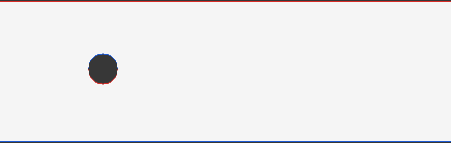
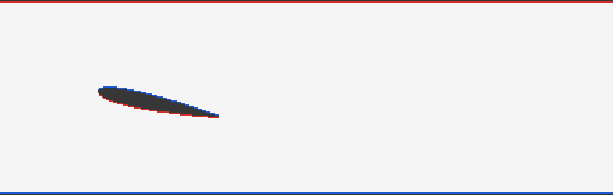
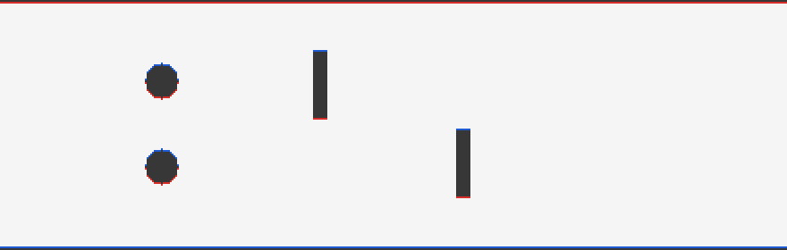

# Wind Tunnel: 2D Lattice Boltzmann Fluid Simulation in C

A 2D wind tunnel simulator written in C using the **Lattice Boltzmann Method (D2Q9)**. Place obstacles in the tunnel, run the simulation, and render the flow as an animated GIF.



*Flow past a cylinder at Re ≈ 140. Red and blue show fluid rotating counterclockwise and clockwise. The alternating blobs downstream are a von Kármán vortex street.*

## Quick start

```
git clone https://github.com/Squimbletin/2D-Lattice-Boltzmann-Fluid-Simulation-in-C.git
cd 2D-Lattice-Boltzmann-Fluid-Simulation-in-C
make wind_tunnel
./wind_tunnel cylinder [Scene / Shape][total steps][time between frames][Mode (velocity or vorticity)]
python tools/make_gif.py
```

## Features

- Lattice Boltzmann solver (D2Q9, BGK collision)
- flat array storing the 9 distribution values for each cell
- Solid obstacles via a cell mask, with bounce-back no-slip walls
- Zou-He velocity inlet and pressure outlet
- Built-in scenes: cylinder, square block, airfoil, and a multi-obstacle course
- Frame renderer (vorticity or speed) that writes images plus a script to stitch them into a GIF
- tests for the grid and the LBM core

## Gallery

| Airfoil (12° angle of attack) | Multiple barriers |
|---|---|
|  |  |

## Getting started

### Requirements

- A C compiler (`gcc`) and `make`
- Python 3 with [Pillow](https://pypi.org/project/pillow/) for making GIFs: `python -m pip install -r requirements.txt`

### Build and run

```
make wind_tunnel
./wind_tunnel cylinder [Scene / Shape][total steps][time between frames][Mode (velocity or vorticity)]
python tools/make_gif.py
```

| Argument | Options | Default |
|---|---|---|
| `scene` | `cylinder`, `block`, `airfoil`, `barriers` | `cylinder` |
| `steps` | total time steps | `10000` |
| `frame_interval` | steps between saved frames | `100` |
| `mode` | `vorticity`, `speed` | `vorticity` |

GIF options: `python tools/make_gif.py [frames_dir] [output.gif] [fps] [downscale]`

Delete the `frames/` folder between runs, since old frames with the same names are otherwise picked up by the GIF.

### Run the tests

```
make test_grid && ./tests/test_grid
make test_lbm && ./tests/test_lbm
```

## Creating scenes

find scenes in `build_scene()` in `src/main.c`. Add a new scene and place shapes in grid coordinates:

```c
} else if (strcmp(scene, "my_scene") == 0) {
    mask_add_circle(mask, 100, mid + 20, 12);              // x, y, radius
    mask_add_rect(mask, 200, mid - 15, 210, mid + 15);      // x0, y0, x1, y1
    mask_add_airfoil(mask, 280, mid, 80, 0.12, 10.0);       // x, y, chord, thickness, angle
}
```

If a scene goes unstable, set `*tau` higher (0.6 to 0.7) or `*u_in` lower (0.05 to 0.08) in that branch.

## How it works

The simulation tracks how much fluid is moving in each of 9 directions at every grid cell. Density and velocity are taken from those 9 values. Each time step does:

1. **Collision:** each cell's distributions relax toward local equilibrium at a rate set by `tau`, which sets the fluid's viscosity: `ν = (tau − 0.5) / 3`.
2. **Bounce-back:** on solid cells (obstacles), populations are reversed so fluid reflects off surfaces.
3. **Streaming:** every distribution moves one cell in its direction.
4. **Boundaries:** a fixed-speed inlet on the left and a fixed-density outlet on the right (wind blows from left to right of the screen), both using Zou-He conditions.

Frames color each cell by vorticity (`∂uy/∂x − ∂ux/∂y`) computed with central differences.

## Limitations

- 2D only. Curved surfaces are stair-stepped by the bounce-back method, so results are good for visualization but are fully realistic.
- Runs at low Reynolds numbers (roughly 100 to 500), far below real aircraft.
- The tunnel walls are close to the obstacles, so blockage affects the flow.
- Single-threaded. The streaming step copies the full grid every step.

## Roadmap

- [ ] Compute lift and drag with the momentum exchange method
- [ ] Plot lift coefficient against angle of attack
- [ ] Faster streaming with buffer swapping and OpenMP
- [ ] Interpolated bounce-back for smoother curved surfaces
- [ ] Extend to 3D (D3Q19)

## License

MIT. See [LICENSE](LICENSE).

##Sources

[1] “Beginner’s guide to aeronautics,” NASA, https://www.grc.nasa.gov/WWW/K-12/airplane/index.html (accessed Jun. 2026). 

[2] Q. Zou and X. He, “On pressure and velocity boundary conditions for the lattice Boltzmann BGK model,” Physics of fluids (1994), vol. 9, no. 6, pp. 1591–1598, June 1997, doi:10.1063/1.869307.

[3] Lattice-Boltzmann fluid dynamics - physics, https://physics.weber.edu/schroeder/javacourse/LatticeBoltzmann.pdf
  
[4] Fluid Dynamics Simulation, https://physics.weber.edu/schroeder/fluids/
